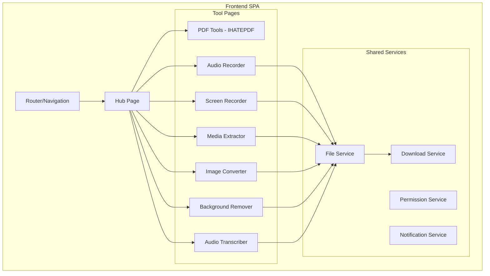

# Design Document: Multimedia Hub

## Overview

Este diseño transforma IHATEPDF en un centro multimedia completo. La arquitectura mantiene el patrón MVC existente y añade nuevos módulos para cada categoría de herramientas. La página principal será un hub con tarjetas de navegación, mientras que cada herramienta tendrá su propia vista dedicada.

Las herramientas utilizarán APIs nativas del navegador:
- **MediaRecorder API** para grabación de audio y pantalla
- **Canvas API** para conversión de imágenes y manipulación
- **Web Speech API** para transcripción de audio a texto
- **FFmpeg.wasm** para extracción de media (procesamiento de video en el navegador)

## Architecture



## Components and Interfaces

### 1. Router/Navigation System

```javascript
// js/router/Router.js
class Router {
  constructor() {
    this.routes = new Map();
    this.currentRoute = null;
  }
  
  register(path, component) { }
  navigate(path) { }
  getCurrentRoute() { }
}
```

### 2. Hub Page Component

```javascript
// js/views/HubPage.js
class HubPage {
  constructor(router) {
    this.router = router;
    this.categories = [
      { id: 'pdf', title: 'Herramientas PDF', icon: '📄', description: 'Combina, divide, comprime y más', path: '/pdf' },
      { id: 'audio-record', title: 'Grabar Audio', icon: '🎤', description: 'Graba audio desde tu micrófono', path: '/audio-record' },
      { id: 'screen-record', title: 'Grabar Pantalla', icon: '🖥️', description: 'Captura tu pantalla en video', path: '/screen-record' },
      { id: 'media-extract', title: 'Extraer Media', icon: '🎬', description: 'Extrae audio o video de archivos', path: '/media-extract' },
      { id: 'image-convert', title: 'Convertir Imágenes', icon: '🖼️', description: 'Convierte entre PNG, JPG, WebP', path: '/image-convert' },
      { id: 'bg-remove', title: 'Quitar Fondo', icon: '✂️', description: 'Elimina el fondo de imágenes', path: '/bg-remove' },
      { id: 'transcribe', title: 'Audio a Texto', icon: '📝', description: 'Transcribe audio a texto', path: '/transcribe' }
    ];
  }
  
  render() { }
  renderCard(category) { }
  handleCardClick(categoryId) { }
}
```

### 3. Audio Recorder Controller

```javascript
// js/controllers/AudioRecorderController.js
class AudioRecorderController {
  constructor(uiManager, downloadService, permissionService) {
    this.mediaRecorder = null;
    this.audioChunks = [];
    this.isRecording = false;
    this.startTime = null;
  }
  
  async requestPermission() { }
  async startRecording() { }
  stopRecording() { }
  getElapsedTime() { }
  generateAudioFile() { }
}
```

### 4. Screen Recorder Controller

```javascript
// js/controllers/ScreenRecorderController.js
class ScreenRecorderController {
  constructor(uiManager, downloadService, permissionService) {
    this.mediaRecorder = null;
    this.videoChunks = [];
    this.isRecording = false;
    this.includeAudio = false;
  }
  
  async requestPermission(includeAudio) { }
  async startRecording() { }
  stopRecording() { }
  generateVideoFile() { }
}
```

### 5. Media Extractor Controller

```javascript
// js/controllers/MediaExtractorController.js
class MediaExtractorController {
  constructor(uiManager, downloadService) {
    this.ffmpeg = null;
    this.loadedFile = null;
  }
  
  async loadFFmpeg() { }
  async analyzeFile(file) { }
  async extractAudio(file) { }
  async extractVideoOnly(file) { }
  getSupportedFormats() { }
}
```

### 6. Image Converter Controller

```javascript
// js/controllers/ImageConverterController.js
class ImageConverterController {
  constructor(uiManager, downloadService) {
    this.canvas = null;
    this.ctx = null;
    this.supportedFormats = ['png', 'jpg', 'webp', 'gif'];
  }
  
  async loadImage(file) { }
  async convertTo(format, quality) { }
  getAvailableFormats() { }
  validateImage(file) { }
}
```

### 7. Background Remover Controller

```javascript
// js/controllers/BackgroundRemoverController.js
class BackgroundRemoverController {
  constructor(uiManager, downloadService) {
    this.canvas = null;
    this.originalImage = null;
    this.processedImage = null;
  }
  
  async loadImage(file) { }
  async removeBackground() { }
  getPreview() { }
  async downloadResult() { }
}
```

### 8. Audio Transcriber Controller

```javascript
// js/controllers/AudioTranscriberController.js
class AudioTranscriberController {
  constructor(uiManager, permissionService) {
    this.recognition = null;
    this.transcript = '';
    this.isTranscribing = false;
  }
  
  checkBrowserSupport() { }
  async startLiveTranscription() { }
  stopTranscription() { }
  async transcribeFile(file) { }
  getTranscript() { }
  copyToClipboard() { }
  downloadAsText() { }
}
```

### 9. Shared Services

```javascript
// js/services/PermissionService.js
class PermissionService {
  async requestMicrophonePermission() { }
  async requestScreenPermission(includeAudio) { }
  handlePermissionDenied(type) { }
}

// js/services/DownloadService.js
class DownloadService {
  downloadBlob(blob, filename) { }
  downloadText(text, filename) { }
}
```

## Data Models

### Category Model

```javascript
const Category = {
  id: String,           // Unique identifier
  title: String,        // Display title
  icon: String,         // Emoji or icon class
  description: String,  // Brief description
  path: String          // Route path
};
```

### Recording State Model

```javascript
const RecordingState = {
  isRecording: Boolean,
  isPaused: Boolean,
  startTime: Number,      // Timestamp
  elapsedTime: Number,    // Seconds
  chunks: Array           // Media chunks
};
```

### Media Track Model

```javascript
const MediaTrack = {
  type: 'audio' | 'video',
  codec: String,
  duration: Number,
  bitrate: Number
};
```

### Conversion Options Model

```javascript
const ConversionOptions = {
  format: 'png' | 'jpg' | 'webp' | 'gif',
  quality: Number,        // 1-100 for JPG
  width: Number,          // Optional resize
  height: Number          // Optional resize
};
```

## Correctness Properties

*A property is a characteristic or behavior that should hold true across all valid executions of a system-essentially, a formal statement about what the system should do. Properties serve as the bridge between human-readable specifications and machine-verifiable correctness guarantees.*

### Property 1: Card navigation consistency
*For any* category card in the hub, clicking on it SHALL navigate to the corresponding tool page path defined in the category configuration.
**Validates: Requirements 1.3**

### Property 2: Card content completeness
*For any* category card rendered in the hub, the card element SHALL contain an icon element, a title element, and a description element.
**Validates: Requirements 1.4**

### Property 3: Recording status display consistency
*For any* active recording (audio or screen), the UI SHALL display a recording indicator and the elapsed time SHALL increase monotonically.
**Validates: Requirements 2.3, 3.3**

### Property 4: Media output format validity
*For any* completed recording (audio or screen), the generated file SHALL be a valid Blob with the correct MIME type (audio/webm for audio, video/webm for video).
**Validates: Requirements 2.5, 3.5**

### Property 5: Video track detection accuracy
*For any* valid video file uploaded to the media extractor, the system SHALL detect and report at least one track (audio or video).
**Validates: Requirements 4.1**

### Property 6: Extraction output availability
*For any* successful media extraction operation, the system SHALL produce a non-empty Blob that can be downloaded.
**Validates: Requirements 4.4**

### Property 7: Image format conversion validity
*For any* valid source image and any supported target format, the conversion SHALL produce a valid image file in the target format with non-zero size.
**Validates: Requirements 5.2**

### Property 8: Background removal transparency preservation
*For any* image processed by the background remover, the output SHALL be a PNG file with an alpha channel (RGBA format).
**Validates: Requirements 6.4**

### Property 9: Processing progress indicator visibility
*For any* long-running operation (background removal, media extraction), the UI SHALL display a progress indicator while the operation is in progress.
**Validates: Requirements 6.5**

### Property 10: Transcription output availability
*For any* completed transcription (live or file-based), the transcript text SHALL be available for copying or downloading.
**Validates: Requirements 7.5**

### Property 11: Client-side processing guarantee
*For any* file processing operation, no network requests SHALL be made to external servers, and the output SHALL be generated as a local Blob/File object.
**Validates: Requirements 8.1, 8.2**

## Error Handling

### Permission Errors
- **Microphone denied**: Display message "Para grabar audio, necesitas permitir el acceso al micrófono en tu navegador"
- **Screen sharing denied**: Display message "Para grabar la pantalla, necesitas permitir compartir pantalla"

### File Errors
- **Invalid file type**: Display message listing supported formats
- **File too large**: Display message with size limit
- **Corrupted file**: Display message suggesting to try another file

### Browser Compatibility
- **API not supported**: Display message indicating which browser features are required
- **Speech recognition unavailable**: Display message suggesting Chrome or Edge browsers

### Processing Errors
- **Conversion failed**: Allow retry with error details
- **Background removal failed**: Allow retry, suggest simpler image
- **Extraction failed**: Display supported formats

## Testing Strategy

### Property-Based Testing Library
Se utilizará **fast-check** para property-based testing en JavaScript.

### Unit Tests
- Test individual controller methods
- Test service functions
- Test data model validation
- Test error handling paths

### Property-Based Tests
Cada propiedad de correctitud será implementada como un test de propiedades usando fast-check:

1. **Property 1 test**: Generate random category configurations, verify navigation paths match
2. **Property 2 test**: Generate random categories, verify rendered cards contain all required elements
3. **Property 3 test**: Simulate recording states, verify UI updates correctly
4. **Property 4 test**: Generate mock recordings, verify output Blob types
5. **Property 5 test**: Generate mock video files, verify track detection
6. **Property 6 test**: Generate extraction scenarios, verify output availability
7. **Property 7 test**: Generate random images and formats, verify conversion output
8. **Property 8 test**: Generate processed images, verify PNG alpha channel
9. **Property 9 test**: Simulate long operations, verify progress indicator state
10. **Property 10 test**: Generate transcription results, verify text availability
11. **Property 11 test**: Monitor network during operations, verify no external requests

### Test Configuration
- Minimum 100 iterations per property test
- Each test tagged with format: `**Feature: multimedia-hub, Property {number}: {property_text}**`

### Integration Tests
- Test complete user flows for each tool
- Test navigation between hub and tools
- Test file upload to download workflows
